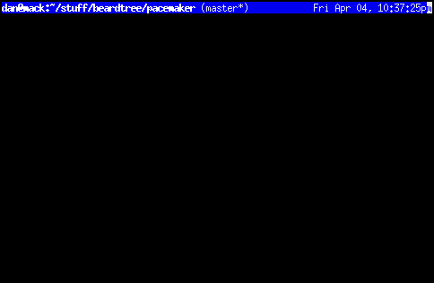

pacemaker
=========

Drift-minimizing setInterval replacement and high-precision timer utility for Node and browser

Installation
------------

In Node: `npm install pacemaker`

In browser:

1. Copy `pacemaker.js` or `pacemaker.min.js` (with optional source map at `pacemaker.min.js.map`)
2. ``
3. `setInterval` and `clearInterval` are automatically replaced -- if this is undesired, `Pacemaker.noConflict();`

Usage
-----

    var Pacemaker = require('pacemaker'); // Node only
    var p = Pacemaker(10, function () {
      console.log('executes in 10 ms');
    }).start();

More examples in [test/pacemaker.js](test/pacemaker.js).
